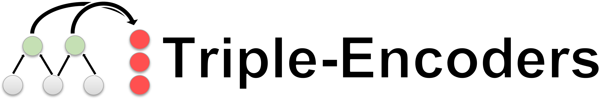
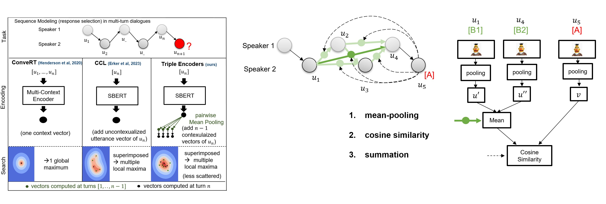

<!--- BADGES: START, copied from sentence transformers, will be replaced with the actual once (removed for anonymity)--->
[][#github-license]
[][#pypi-package]
[][#pypi-package]


[#github-license]: https://github.com/
[#pypi-package]: https://pypi.org/project/triple-encoders/

<p align="center">
  
</p>

<p align="center">
    🤗 <a href="anonymous" target="_blank">Models</a> | 📊 <a href="anonymous" target="_blank">Datasets</a> | 📃 <a href="anonymous" target="_blank">Paper</a>
</p>

`triple-encoders` is a library for contextualizing distributed [Sentence Transformers](https://sbert.net/) representations. 
At inference, triple encoders can be used for retrieval-based sequence modeling via sequential modular late-interaction: 
<p align="center">
  
</p>

Representations are encoded **separately** and the contextualization is **weightless**:
1. *mean-pooling* to pairwise contextualize sentence representations (creates a distributed query)
2. *cosine similarity* to measure the similarity between all query vectors and the retrieval candidates.
3. *summation* to aggregate the similarity (similar to average-based late interaction of [ColBERT](https://github.com/stanford-futuredata/ColBERT)).

## Key Features
- 1️⃣ **One dense vector vs distributed dense vectors**: in our paper we demonstrate that our late interaction-based approach outperforms single-vector representations on long sequences, including zero-shot settings.
- 🏎️💨 **Relative compute**: as every representation is encoded separately, you only need to encode, compute mixtures and similarities for the latest added representation (in dialog: the latest utterance). 
- 📚 **No Limit on context-length**: our distributed sentence transformer architecture is not limited to any sequence length. You can use your entire sequence as query!
- 🌎 **Multilingual support**: `triple-encoders` can be used with any [Sentence Transformers](https://sbert.net/) model. This means that you can model multilingual sequences by simply training on a multilingual model checkpoint. 


## Installation

```bash
!python -m pip install triple-encoders
``` 

# Getting Started

Our experiments for sequence modeling and short-term planning conducted in the paper can be found in the `notebooks` folder. The hyperparameter that we used for training are the default parameters in the `trainer.py` file.

## Retrieval-based Sequence Modeling
We provide an example of how to use triple-encoders for conversational sequence modeling (response selection) with 2 dialog speakers. If you want to use triple-encoders for other sequence modeling tasks, you can use the `TripleEncodersForSequenceModeling` class.

### Loading the model
```python
from triple_encoders.TripleEncodersForConversationalSequenceModeling import TripleEncodersForConversationalSequenceModeling

triple_path = ''

# load model
model = TripleEncodersForConversationalSequenceModeling(triple_path)
```

### Inference

```python
# load candidates
candidates = ['I am doing great too!','Where did you go?', 'ACL is an interesting conference']

# load candidates and store index
model.load_candidates_from_strings(candidates, output_directory_candidates_dump='output/path/to/save/candidates')

# create a sequence
sequence = model.contextualize_sequence(["Hi!",'Hey, how are you?'], k_last_rows=2)

# model sequence (compute scores for candidates)
sequence = model.sequence_modeling(sequence)

# retrieve utterance from dialog partner
new_utterance = "I'm fine, thanks. How are you?"

# pass it to the model with dialog_partner=True 
sequence = model.contextualize_utterance(new_utterance, sequence, dialog_partner=True)

# model sequence (compute scores for candidates)
sequence = model.sequence_modeling(sequence)

# retrieve candidates to provide a response
response = model.retrieve_candidates(sequence, 3)
response
#(['I am doing great too!','Where did you go?', 'ACL is an interesting conference'],
# tensor([0.4944, 0.2392, 0.0483]))
```
**Speed:** \
Time to load candidates: 0:00:00.031815 seconds \
Time to contextualize sequence: 0:00:00.018078 seconds \
Time to model sequence: 0:00:00.000256 seconds \
Time to contextualize new utterance: 0:00:00.015858 seconds \
Time to model new utterance: 0:00:00.000213 seconds \
Time to retrieve candidates: 0:00:00.000093 seconds 

### Evaluation
```python
from datasets import load_dataset

dataset = load_dataset("daily_dialog")
test = dataset['test']['dialog']

df = model.evaluate_seq_dataset(test, k_last_rows=2)
df
# pandas dataframe with the average rank for each history length
```

## Short-Term Planning (STP)
Short-term planning enables you to re-rank candidate replies from LLMs to reach a goal utterance over multiple turns.

### Inference

```python
from triple_encoders.TripleEncodersForSTP import TripleEncodersForSTP

model = TripleEncodersForSTP(triple_path)

context = ['Hey, how are you ?',
           'I am good, how about you ?',
           'I am good too.']

candidates = ['Want to eat something out ?',
              'Want to go for a walk ?']

goal = ' I am hungry.'

result = model.short_term_planning(candidates, goal, context)

result
# 'Want to eat something out ?'
```
### Evaluation

```python
from datasets import load_dataset
from triple_encoders.TripleEncodersForSTP import TripleEncodersForSTP

dataset = load_dataset("daily_dialog")
test = dataset['test']['dialog']

model = TripleEncodersForSTP(triple_path, llm_model_name_or_path='your favorite large language model')

df = model.evaluate_stp_dataset(test)
# pandas dataframe with the average rank and Hits@k for each history length, goal_distance
```


# Training Triple Encoders
Triple Encoders are build upon Sentence Transformers. At this point, our  loss function and evaluator are not yet integrated into the Sentence Transformers library. 
After installing Sentence Transformers, you can add the files in  `sentence-transformers` to the respective directories in the sentence-transformers library. 
This will allow you to train your own triple encoders with Contextualized Curved Contrastive Learning (C3L) loss and Triple Similarity Evaluator.

```python
from triple_encoders.trainer import TripleEncoderTrainer
from datasets import load_dataset

dataset = load_dataset("daily_dialog")

trainer = TripleEncoderTrainer(base_model_name_or_path=,
                               batch_size=48,
                               observation_window=5,
                               speaker_token=True,
                               num_epochs=3,
                               warmup_steps=10000)

trainer.generate_datasets(
    dataset["train"]["dialog"],
    dataset["validation"]["dialog"],
    dataset["test"]["dialog"],
)


trainer.train("output/path/to/save/model")
```
## Citation
If you use triple-encoders in your research, please cite the following paper:
```
% todo
@article{anonymous,
  title={Triple Encoders: Represenations That Fire Together, Wire Together},
  author={Justus-Jonas Erker, Florian Mai, Nils Reimers, Gerasimos Spanakis, Iryna Gurevych},
  journal={axiv},
  year={2024}
}
```
# Contact
Contact person: Justus-Jonas Erker, justus-jonas.erker@tu-darmstadt.de

https://www.ukp.tu-darmstadt.de/

https://www.tu-darmstadt.de/

Don't hesitate to send us an e-mail or report an issue, if something is broken (and it shouldn't be) or if you have further questions.
This repository contains experimental software and is published for the sole purpose of giving additional background details on the respective publication. 

# License
triple-encoders is licensed under the Apache License, Version 2.0. See [LICENSE](LICENSE) for the full license text.


### Acknowledgement
this package is based upon the [imaginaryNLP](https://github.com/Justus-Jonas/imaginaryNLP) and [Sentence Transformers](https://sbert.net/).


